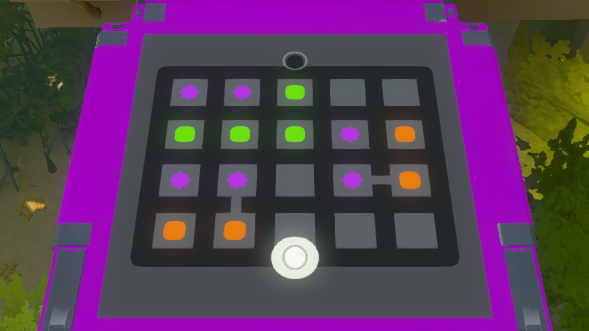
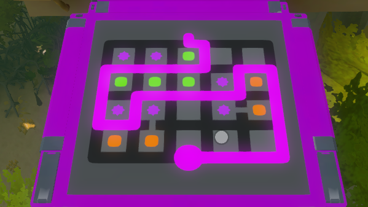

# The Witness Solver

Framework for solving "The Witness" game's puzzles.

## Usage

Define a puzzle in terms of 2D array. E.g., for following puzzle


one would define array similar to this one:
```lisp
(defparameter *puzzle*
  (make-array '(9 11) :initial-contents
              '(("." "." "." "." "." "." "." "." "." "." ".")
                ("." "1" "." "1" "." "2" "." "0" "." "0" ".")
                ("." "." "." "." "." "." "." "." "." "." ".")
                ("." "2" "." "2" "." "2" "." "1" "." "3" ".")
                ("." "." "." "." "." "." "." "." "." "." ".")
                ("." "1" "." "1" "." "0" "." "1" "-" "3" ".")
                ("." "." "." "-" "." "." "." "." "." "." ".")
                ("." "3" "." "3" "." "0" "." "0" "." "0" ".")
                ("." "." "." "." "." "." "." "." "." "." "."))))
```

Then you have to define what is considered a valid solution and
just call solve `solve` and you'll get a list of possible solutions:
```
.....xx....
.1.1.2x0.0.
xxxxxxx.xxx
x2.2.2.1x3x
x.xxxxxxx.x
x1x1.0.1-3x
xxx-......x
.3.3.0.0.0x
.....xxxxxx


....xx.....
.1.1x2.0.0.
xxxxx...xxx
x2.2.2.1x3x
x.xxxxxxx.x
x1x1.0.1-3x
xxx-......x
.3.3.0.0.0x
.....xxxxxx

etc...
```



Complete code for this example could be found [here](src/puzzles/tree-house-3.lisp).
